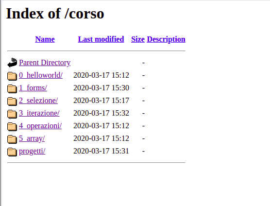

# Corso WebDesign
## Introduzione alla programmazione con PHP

### Contenuto di Corso ed Esercizi

Questo repository contiene tutto il codice e i materiali didattici utilizzati nella parte di programmazione del corso.

Per quanto riguarda i contenuti, il corso partirà definendo gli elementi strutturali della programmazione in PHP, i concetti di rete e tutti i protocolli, le tecnologie e i metodi relativi alle strutture web che utilizzeremo per creare i progetti e svolgere gli esercizi.

Online è presente un libro digitale con tutti gli argomenti svolti e alcuni esercizi divisi per sezioni. Lo potete trovare al seguente link: [Introduzione alla Programmazione per il Web con PHP](https://giacomoalbe.github.io/intro-prog-web/introduzione.html)

### Installazione e Uso

Per utilizzare il codice qui contenuto sarà necessario far partire il servizio Apache di Xampp dal nostro computer e quindi dirigersi nel proprio browser all'indirizzo corrispondente al file PHP che si intende aprire.

Il persorso che dovremo digitare sul browser è quello della risorsa che stiamo cercando (il file PHP) relativo alla cartella `C:\xampp\htdocs` presente sul nostro compuer.

Se ad esempio volessivo accedere alla risorsa contenuta nella cartella `ciaomondo` all'interno di htdocs, sarà sufficiente scrivere sul nostro browser:

`
  localhost/ciaomondo/
`

Dove `localhost` è il nome del nostro PC all'interno della nostra rete.

Per scaricare il codice di questo repository si deve cliccare sul pulsante verde `Clona o scarica` in alto a sinistra e quindi `Scarica come ZIP`. A quel punto sarà sufficiente scompattare lo zip e posizionare la cartella risultante all'interno di `C:\xampp\htdocs\corso` presente nel vostro sistema.

Inserendola in una sottocartella chiamata `corso` si evita di mischiare il vostro codice con quello di rifermento dato che i nomi delle sottocartelle sarebbero gli stessi.

Ad esempio, scaricando l'intero repository come file .zip e scompattandolo (tasto destro -> Estrai Archivio o equivalente) nella cartella `C:\xampp\htdocs\corso` dovreste essere in grado di eseguire il codice digitando all'interno del vostro browser il seguente indirizzo:

`
  localhost/corso/
`

E vedere come risultato la seguente immagine:

